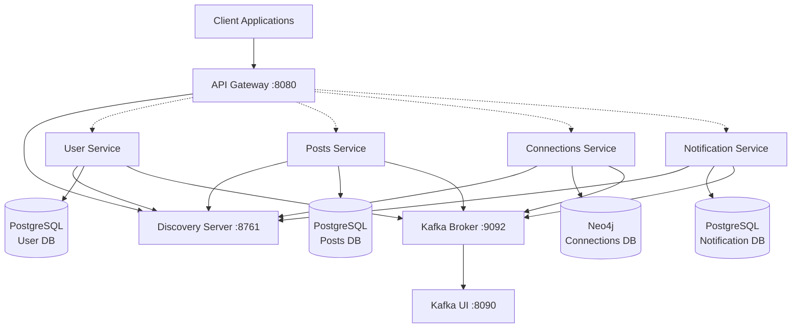

**Connectly** is a social networking platform built using microservices architecture. The system manages user connections through a graph database and provides a scalable foundation for social features including connection requests, acceptance/rejection workflows, and event-driven notifications.

### Architecture Patterns
- Microservices Pattern
Each service is an independently deployable Spring Boot application registered with Eureka for dynamic service discovery. Services communicate via:

- Synchronous: REST APIs through the API Gateway
Asynchronous: Kafka event streams
For details, see Service Discovery with Eureka and Event-Driven Communication.

- API Gateway Pattern
The ApiGatewayApplication serves as the single entry point at port 8070, implementing:

Route-based request forwarding using Spring Cloud Gateway
JWT-based authentication via AuthenticationFilter
Path prefix stripping (StripPrefix=2) to translate external URLs to service-internal paths
For implementation details, see Request Routing and JWT Authentication.

**Event-Driven Architecture
The connections service publishes domain events to Kafka topics when connections are created or accepted, enabling loosely coupled integration with other services (notifications, activity feeds, analytics).

### Project Overview

**Connectly** is a microservices application built with Spring Boot that includes:
- **4 Core Services**: User Service, Posts Service, Connections Service, and Notification Service [1](#0-0) 
- **Service Discovery**: Eureka Server for service registration [2](#0-1) 
- **API Gateway**: Single entry point for all services [3](#0-2) 
- **Message Broker**: Kafka (KRaft mode) for event-driven communication [4](#0-3) 
- **Databases**: PostgreSQL for user/posts/notifications, Neo4j for connections graph [5](#0-4) 

### Architecture Diagram



### Service Ports

| Service | Port |
|---------|------|
| API Gateway | 8080 |
| Discovery Server | 8762 (Docker) / 8761 (K8s) |
| Kafka UI | 8090 |
| Neo4j Browser | 7474 |
| Neo4j Bolt | 7687 |

<cite/>

## Docker Compose Deployment

### Prerequisites
- Docker and Docker Compose installed
- At least 4GB RAM available

### Steps

1. **Clone the repository**
```bash
git clone <repository-url>
cd connectly-microservice
```

2. **Start all services**
```bash
docker-compose up -d
``` [6](#0-5) 

3. **Verify services are running**
```bash
docker-compose ps
```

4. **Access the application**
    - API Gateway: http://localhost:8080
    - Eureka Dashboard: http://localhost:8762
    - Kafka UI: http://localhost:8090
    - Neo4j Browser: http://localhost:7474 (credentials: neo4j/password)

5. **View logs**
```bash
docker-compose logs -f [service-name]
```

6. **Stop all services**
```bash
docker-compose down
```

7. **Clean up volumes** (removes all data)
```bash
docker-compose down -v
```

<cite/>

## Kubernetes Deployment

### Prerequisites
- Kubernetes cluster (minikube, kind, or cloud provider)
- kubectl configured
- At least 8GB RAM available for the cluster

### Steps

1. **Apply database deployments first**
```bash
kubectl apply -f k8s/notification-db.yml
kubectl apply -f k8s/posts-db.yml
kubectl apply -f k8s/user-db.yml
kubectl apply -f k8s/connections-db.yml
``` [7](#0-6) [8](#0-7) 

2. **Deploy Kafka**
```bash
kubectl apply -f k8s/kafka.yml
``` [9](#0-8) 

3. **Deploy Kafka UI (optional)**
```bash
kubectl apply -f k8s/kafkaui.yml
``` [10](#0-9) 

4. **Deploy Discovery Server**
```bash
kubectl apply -f k8s/discovery-server.yml
``` [11](#0-10) 

5. **Wait for Discovery Server to be ready**
```bash
kubectl wait --for=condition=ready pod -l app=discovery-server --timeout=300s
```

6. **Deploy microservices**
```bash
kubectl apply -f k8s/user-service.yml
kubectl apply -f k8s/notification-service.yml
kubectl apply -f k8s/connections-service.yml
kubectl apply -f k8s/posts-service.yml
``` [12](#0-11) 

7. **Deploy API Gateway**
```bash
kubectl apply -f k8s/api-gateway.yml
``` [13](#0-12) 

8. **Verify all pods are running**
```bash
kubectl get pods
kubectl get services
```

9. **Access the application**

For Minikube:
```bash
minikube service api-gateway --url
```

For port-forwarding:
```bash
kubectl port-forward service/api-gateway 8080:80
```

10. **View logs**
```bash
kubectl logs -f deployment/[service-name]
```

11. **Scale services** (if needed)
```bash
kubectl scale deployment user-service --replicas=3
```

12. **Clean up**
```bash
kubectl delete -f k8s/
```

### Resource Requirements

| Component | CPU Request | CPU Limit | Memory Request | Memory Limit |
|-----------|-------------|-----------|----------------|--------------|
| API Gateway | 100m | 200m | 100Mi | 500Mi |
| Discovery Server | 100m | 200m | 100Mi | 500Mi |
| User Service | 100m | 200m | 200Mi | 400Mi |
| Posts Service | 100m | 200m | 200Mi | 400Mi |
| Connections Service | 100m | 200m | 200Mi | 400Mi |
| Notification Service | 100m | 200m | 200Mi | 400Mi |
| Kafka (per pod) | 100m | 200m | 512Mi | 1Gi |
| Neo4j | 100m | 200m | 600Mi | 4Gi |
| PostgreSQL DBs | 100m | 200m | 100Mi | 200Mi | [14](#0-13) [15](#0-14) [16](#0-15) 

## Notes

- The Docker Compose setup uses a shared network `connectly-network` for service communication [17](#0-16) 
- All PostgreSQL databases use the same credentials (vishesh/vishesh15th) in both Docker and K8s deployments [18](#0-17) 
- Kafka runs in KRaft mode (no Zookeeper) with 2 replicas in Kubernetes [19](#0-18) 
- Services use Spring profiles: default for Docker Compose, `k8s` for Kubernetes [20](#0-19) 
- The Kubernetes deployment uses StatefulSets for databases to ensure data persistence [7](#0-6) 
- Neo4j credentials are set to neo4j/password in both environments [21](#0-20)

